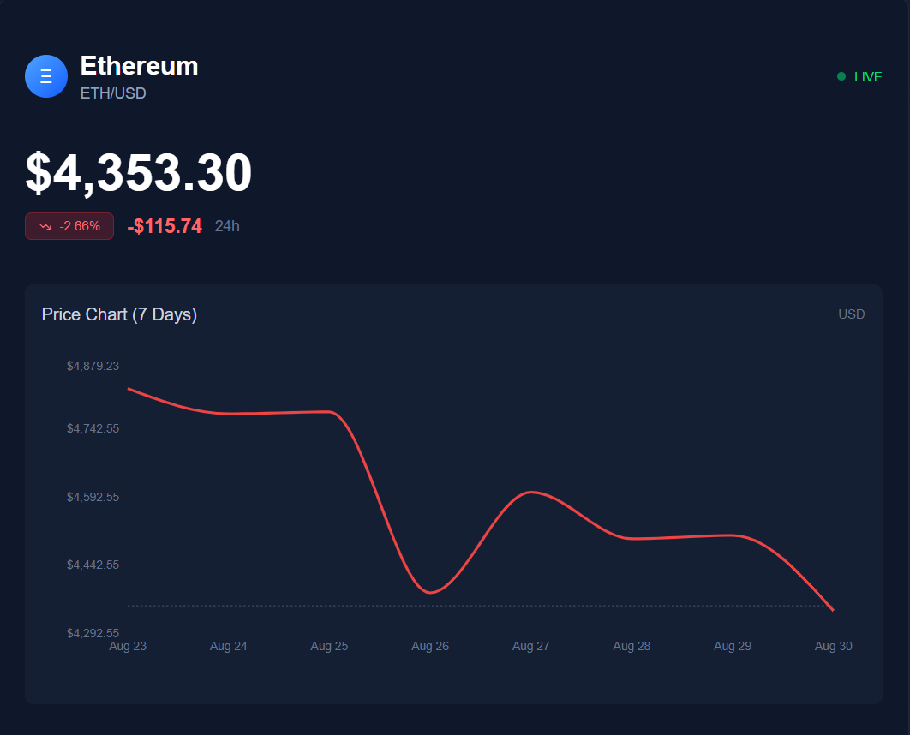

# Overwhelm - Trading PlayGround 

Overwhelm is a decentralized trading dApp designed to help beginners step into the world of trading without the risks of losing real money. Using dummy tokens, users can learn the ins and outs of trading while still experiencing real-time market dynamics. With live price feeds for Ethereum (ETH) and USD tokens, users can practice trading just like in real markets. A built-in faucet lets them wrap their Sepolia ETH into WETH, forming the foundation for all trades inside the app.

This immersive and risk-free environment provides an ideal training ground for aspiring traders to hone their skills and build confidence before venturing into live markets.

   // ethereum price

## Table of Contents

- [Core Features](#core-features)  
- [Tech Stack](#tech-stack)  
- [UI Components](#ui-components)  
- [Rating Tech Stack](#rating-tech-stack)  
- [Future Plans](#future-plans)  

## Core Features

- *Risk-Free Trading*  
Experiment with trading strategies using dummy tokens without any real financial consequences.
- *Real-Time Market Data*  
Experience authentic market conditions with live price feeds for ETH and USD tokens
- *Seamless Onboarding*  
Get started quickly and easily with embedded wallet creation.
- *Practice with WETH*  
A built-in faucet allows you to wrap Sepolia ETH into WETH to use in the trading playground.
- *Enhanced Privacy*  
An extra layer of privacy and authentication is provided through the use of Zero-Knowledge Proofs.

## Tech Stack

- *Frontend:* Next.js (App Router), Tailwind , Typescript  
- *Wallet* Privy  
- *Blockchain Integration:* wagmi, viem  
- *Second Layer Auth * Zero-Knowledge Proof
- *Event quering and fetching (indexing)* Graph Protocol
- *Live Price* Chanlink Smart Feed 
- *ERC20* Solidity Contract

## UI Components

### 1. Landing Page  

A clean welcome screen prompting users to connect their wallet and start exploring.

### 2. Dashboard  

User control panel showing balances, usage stats, and quick navigation.

### 3. Decks List  

Searchable grid/list of all on-chain decks, with key metrics (returns, risk, entry cost).

### 4. Portfolio  

Personal summary of invested decks, profits, and withdrawal options.

### 5. Deck Creation  

Form-based UI to define strategy parameters, pay creation fee, and submit for approval.

### 6. Buy Token  

In-app swap interface to buy the platform’s token with RTBTC.

## 🤖 AI’s View on Investment in Decks  

Visualization of how our AI model evaluates deck performance and suggests portfolio allocations.

